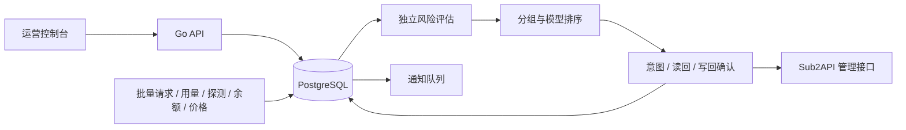

# 架构

Upstream Pilot 由 Go API/后台任务、PostgreSQL 状态存储、React 控制台组成。前端构建产物嵌入 Go 可执行文件。

## 代码边界

- `cmd/upstream-pilot`：配置、迁移、HTTP 服务和后台任务生命周期。
- `internal/quality`：风险状态和确定性的候选排序。
- `internal/app/engine_*`：证据有效性、共享分组组件、待办核对及受控写回。
- `internal/upstream`：Sub2API/NewAPI 客户端、流式解析与外部 HTTP 限制。
- `internal/database/migrations`：顺序迁移，启动时以数据库锁串行执行。
- `internal/auditlog`：按所有者存储的审计日志。
- `web/src`：认证、质量、账号、分组、通知和管理界面。

账号是上游凭据/端点，分组是候选池。共享账号连接多个组时，无法同时满足的顺序会产生冲突，而不是由执行顺序决定结果。

## 一轮决策

加载账号与证据，读取远端当前值，生成组内顺序，然后按相关组件执行。写回前记录意图；远端结果与本地事务不能合并为原子事务，因此中断后需先确认已执行字段、撤销未执行目标，再重新计划。失败隔离到有共享依赖的组件。

风险分为失败、慢请求、余额和价格，各自保存证据与恢复计数。快照使用时重新检查时间；不能以采集器上一次成功的布尔标记无限延长有效期。真实首字样本足量且未过期时优先用于排序，否则回退到有效探测数据。站点请求和 usage 各拉取一次，再按账号、组和 request_id 分发；合成探测使用独立 request/session ID 并从用户统计和流量结构中排除。

## 来源证据与原生资格

`source_generation` 与 `config_generation` 分开：端点、凭据、来源、模型映射、探测目标或计费换算变化时才替换来源代次；普通库存刷新不会替换。数据库触发器覆盖账号和站点更新。探测记录保留来源代次，余额快照同时校验当前 cache key；采价和流量写入拒绝旧代次，余额历史单独保留。已有无来源证明的旧数据仅作历史，升级后等待重新采集。

原生候选资格单独显示。当前认证 OpenAI/Anthropic API Key 账号的基本约束：手动开关、状态、冷却、过载、限流、到期、额度、模型映射及分组成员。字段缺失、其他账号类型或未知容量不能作为停调保护的备用。并发字段仅代表配置上限，瞬时槽位仍由 Sub2API 决定。停调前重新读取备用，并在最后一次读回后重新检查时间。

质量风险、采集故障和控制失败分别记录。`operational_incidents` 按账号/采集或控制通道维护事件周期；每次发生和恢复通过同一事务写入通知 outbox，重复重试不重复通知。待确认控制保留起始时间，超过五分钟产生单独事件。旧意图先核对已发生副作用，再撤销未执行目标；更换目标站点后无法确认的旧意图需人工处理。

## 供应商、成本与调度稳定性

账号的供应商、失效域和共享额度池需要操作员确认，并绑定来源代次。相同供应商、失效域、额度池或 URL+凭据进入同一故障组件；不同域名只作为线索。原生接口未证明实时并发和排队读取成功时，容量保持 unknown。

模型采购价区分输入、输出、缓存读写、币种、token 单位、换算、倍率与充值比例。只有同一组、同一模型、同一 token 口径及当前用量结构下的成本才可比较。余额续航需要同来源、同单位、至少四个点和十五分钟跨度；充值、重置或高波动使预测失效。任何自动控制都不写用户售价。

健康候选使用绝对/相对改善阈值和最短保持时间；硬故障与已拥有的暂停恢复不等待。灰度范围和每轮动作数量可控。确认完成的动作保存计划、来源/配置代次、前后值、涉及池和前后观察窗口；样本不足、档案变化或人工冲突时效果保持未验证。

调度任务使用 UUID 租约拥有者、30 秒续租和丢失取消。站点级任务共用资源租约及 advisory lock，防止采集/库存/控制互锁；每次执行另存 task_runs。控制整轮有 90 秒上限。

## 仍需注意

本项目不是请求代理，也不能制造供应商容量。上游接口能力和字段会随版本变化；目标实例不提供最终结果、流结束或可靠容量字段时，相应结论保持 unknown。实现与验收状态见 `IMPLEMENTATION_LEDGER.md`。

## 统一消息投递

既有 `quality_notifications` 作为统一事件表继续保留。数据库触发器在事件事务内补充站点/分组上下文，并为已启用、订阅匹配的 `notification_channels` 创建 `notification_deliveries`。余额采集器只维护事件周期，不再直接调用企业微信。采购通知有独立的累计基准与冷却状态，质量状态和调度规则不会因通知阈值改变。

同一 sender 处理飞书、企业微信和通用 Webhook。每条投递有独立尝试、渠道配置版本和 UUID 租约；旧 worker 回执不能覆盖新租约。渠道改动、账号换源和事件过期会终止相应旧投递，HTTP 业务回执确认后才记录送达。原配置密文以原 AEAD 用途迁移，渠道编辑后重新加密。详见 [消息中心](NOTIFICATIONS.md)。
